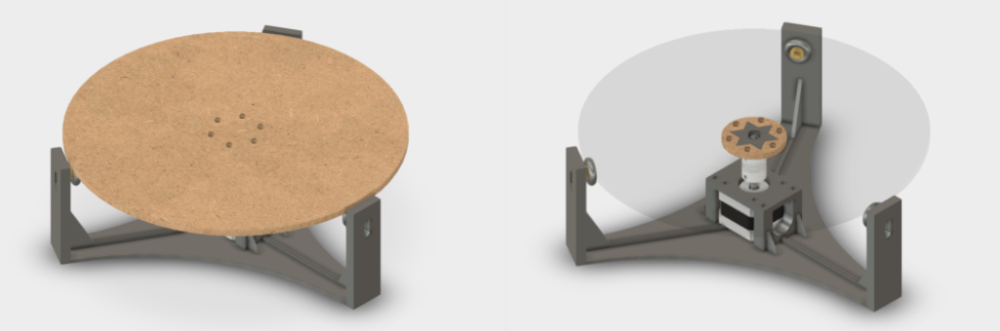
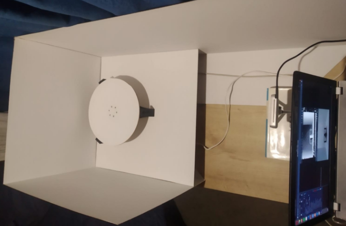
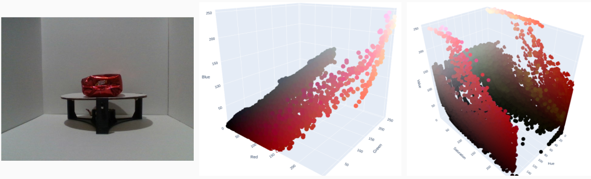
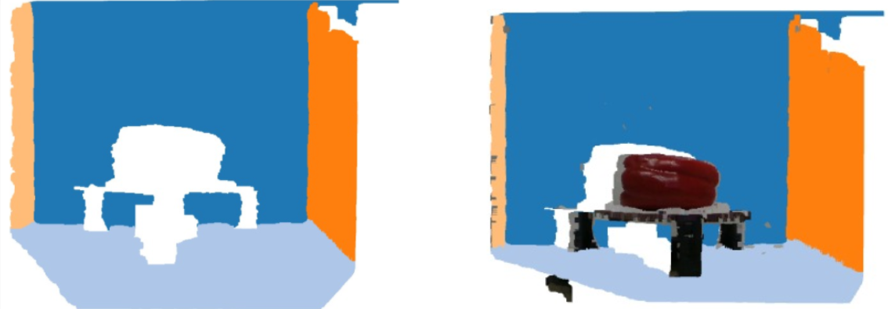
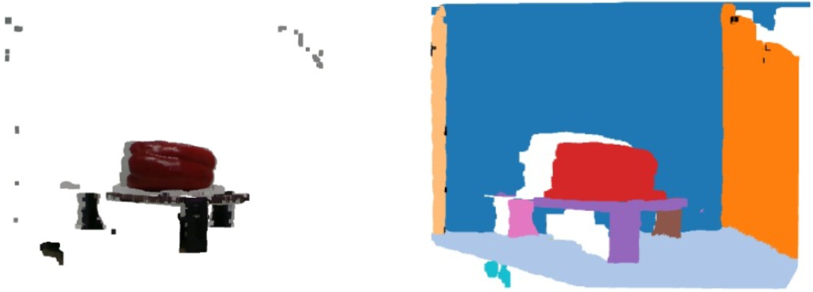
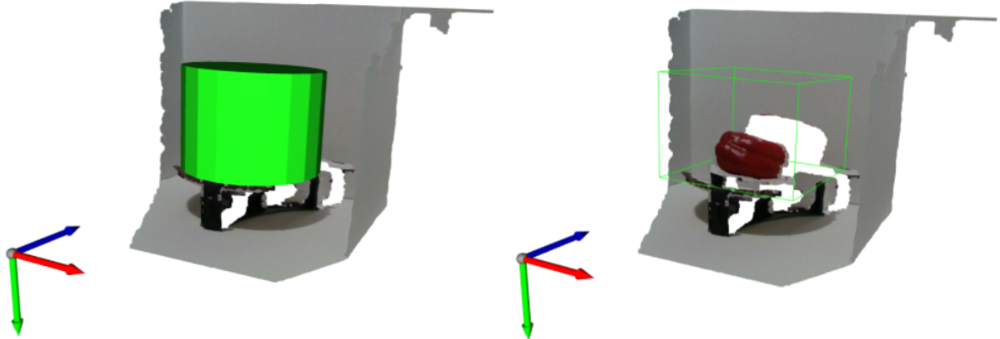
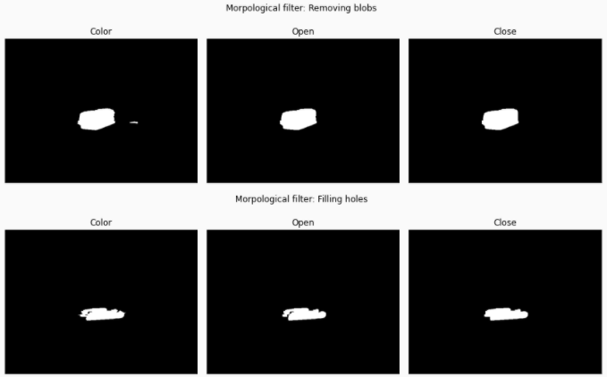
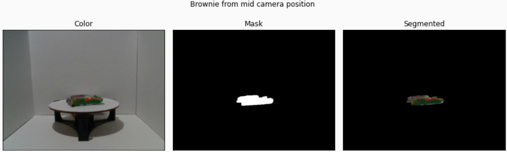
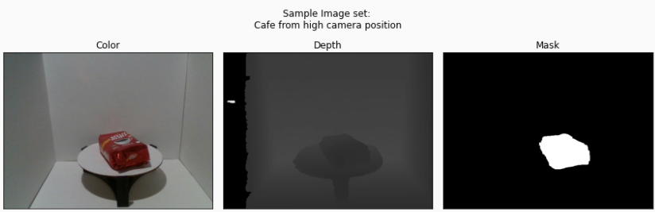

# Dataset UNAL APC

This work was a first effort to build a dataset at the Universidad Nacional de Colombia for object segmentation tasks in the context of robotic manipulation applications.

## Results

A [turntable](https://a360.co/3d468UQ) with a stepper motor controlled in open loop with an arduino was designed and proptptyped. Together with an [Intel RealSense D415 Camera](https://www.intelrealsense.com/depth-camera-d415/) an automated image acquisition process was designed and implemented.  

### Image Acquisition

Turntable:

Setup:

The turntable was controlled using [PySerial](https://github.com/pyserial/pyserial) and the camera frames were captures using the [Intel librealsense SDK wrapper for Python](https://github.com/IntelRealSense/librealsense/tree/master/wrappers/python), allowing us to automate the image acquisition process.

### Image Processing

Three different approaches were explored to segment the images

Color distribution:

Two approaches based in point cloud processing using [Open3D](http://www.open3d.org)

Point cloud segmentation with RANSAC plane detection and DBSCAN clustering:

Spatial based segmentation in the point cloud:

The spatial approach was used to obtain a preliminary version of the binary mask which were postprocessed with a morphological filter using [OpenCV](https://opencv.org)

A sample segmented image:

Finally 8400 image were produced, with 14 classes, 3 camera positions per class, 200 images per camera position and three images per image set.

A sample image set:

## What is in this repository?

- File to reproduce the conda virtual environment used in thios project at `cv_env.yml` 
- Sample camera calibration file exported with its SDK at `calibration_data.json`
- Notebook to explore and test the camera with its SDK at `realsense_test.ipynb`
- Code to encapsulate camera manipulation and a simple test of it at `realsense_depth/`
- Code to encapsulate the turntable at `turntable.py`
- Different arduino programs to test the turntable at `my_turntable/`
- A simple script to test PySerial with the arduino at `pyserial_test.py`
- Script to capture and store color and depth frames using the turntable to move the object 1.8° between frames at  `take_photos.py`
- Utility script used to delete depth colored images at `clean_imgs.py`
- Utility script used to convert depth images to .png format (originally stored as .tiff) at `convert_imgs.py`
- Notebook used to produce 3D visualizations and export them to HTML at  `animations.py`
- Notebook exploring Open3D and point cloud creation from RGBD images at `pcd_exploration.ipynb`
- Notebook used to explore poit cloud segmentation with RANSAC plane detection and DBSCAN clustering at `pcd_segmentation.ipynb`
- Notebook used to explore spatial segmentation at `pcd_segmentation_geometry.ipynb`
- JSON file storing cylinder parameters used for spatial segmentation at `cylinders.json`
- Utility functions to deal with Open3D point clouds, including loading cylinders as volume of interest for spatial segmentation at `pcd_utils.py`
- Logging configuration at `logging_config.py`
- Script used to obtain binary masks for all images at `segmentation.py`
- Notebook used to explore and try the morphological filter at `mask_postproc.ipynb`
- Script used to apply the morphological filter to all binary masks at `mask_postproc.py`

## What is **NOT** in this repository?

- The images of the dataset, including calobration files stored while capturing them.
- 3D Visualizations produced with [Plotly](https://plotly.com) for color distributions in HSV and RBG space
- Gifs to visualize image acquisition process and its compressed versions.
- Image processing scripts log files.